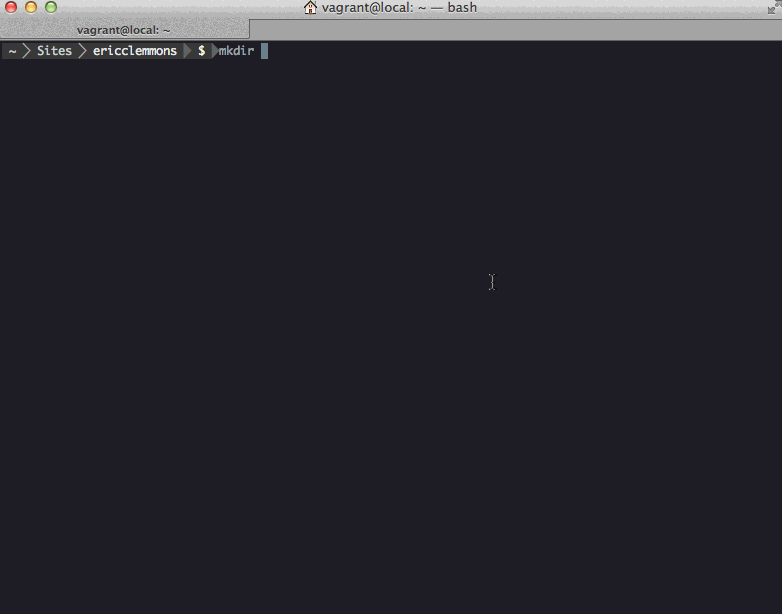

Genesis WordPress
=================

> Rapidly create, develop, & deploy WordPress across multiple environments.
> 

## Features

- Generate a functional WordPress site + server
- First-class local development
- Independently stage features for review
- Use production data when developing
- High-performance, zero-configuration caching out of the box
- Easily monitor remote server errors
- Instant, secure SSH access
- Automated server provisioning
- Consistent, reliable environments

## Installation

Ensure you have the latest versions of [NodeJS][9] **v0.10**, [Vagrant v1.2.7](http://downloads.vagrantup.com/tags/v1.2.7), & [VirtualBox][8].

### Scaffolding & Development

Install [Yeoman][2] **v1**, [Bower][6] **v1.2**, [Genesis WordPress Generator][1], & [Vagrant Host Manager][4]:

    $ npm install -g yo bower generator-genesis-wordpress
    $ vagrant plugin install vagrant-hostmanager

If you get EMFILE issues, try running: `$ ulimit -n 4096`.

*(You can check your versions by running `node --version`, `npm --version`, etc.)*

### Deployment

Install [Capistrano][5] & [Ansible][7]:

    $ sudo gem install capistrano capistrano-ext colored
    $ sudo easy_install pip
    $ sudo pip install ansible

## Getting Started

## Step 1 – Creating or Upgrading a Site

*Use the [Genesis WordPress Generator][1] for scaffolding.*

## Step 2 – Working Locally

First, ensure you're using the latest version of [Genesis WordPress][0] with [Bower][6]:

    $ bower update

Next, use [Vagrant][3] to create & provision your local environment:

    $ vagrant up

Now open http://local.mysite.com (or whatever your site's domain name is)!

If the site doesn't load for you, you may have to manually
provision your local machine:

    $ vagrant provision

Or, update your local `/etc/hosts` with [Vagrant Host Manager][4]:

    $ vagrant hostmanager

Finally, if things worked worked you were at the office but broke when you got home, you probably need
to just get Vagrant a new IP address:

    $ vagrant reload

## Step 3 – Wrapping Up

When you're done working on your site, suspend the VM to save on CPU & memory:

    $ vagrant suspend

You can destroy the VM entirely (while keeping your local files) to save on disk space:

    $ vagrant destroy

## Deployment

First, ensure your project on Github can be accessed by remote servers.  To do this,
access the project's *Settings -> Deploy Keys* in Github and add `provisioning/files/ssh/id_rsa.pub`.

Next, assuming the server has been provisioned, deploy your code on Github:

    $ cap production deploy

The latest code is now live:

    > http://production.mysite.com/

If you deploy to `staging`, the name of the current branch (e.g. `my-feature`) is deployed:

    > http://my-feature.staging.mysite.com/

In the rare event the changes weren't supposed to go live, you can rollback to the previous release:

    $ cap production deploy:rollback

**Note that deployments use the project's *Github repository* as the source, not your local machine!**

## Syncing Files/Database

### From Local to Remote

Suppose you have just provisioned & deployed to a new server, but the site obviously won't work without
a database or uploaded images.

You can **overwrite the remote database** with your local VM's:

    $ cap production genesis:up:db

You can sync your local files to the remote filesystem:

    $ cap production genesis:up:files

Or, you can perform both actions together:

    $ cap production genesis:up

Once a site is live, you *rarely* need to sync anything up to the remote server.  If anything,
you usually sync changes *down*.

### From Remote to Local

Suppose you have a live site that you need to work on locally.  Like the previous section,
you can sync down the database, the files (e.g. uploaded images), or both:

    $ cap production genesis:down:db
    $ cap production genesis:down:files
    $ cap production genesis:down

## Provisioning

The following environments are expected to exist and resolve via DNS to simplify deployment & provisioning:

- `local` (e.g. http://local.mysite.com)
- `staging` (e.g. http://staging.mysite.com/, http://my-feature.staging.mysite.com/)
- `production` (e.g. http://production.mysite.com/, http://www.mysite.com/, http://mysite.com/)

If you're deploying to a new machine (e.g. production.mysite.com), you first need to provision it:

    $ cap production genesis:provision

If there is an error, you may be prompted to re-run the command with an explicit username/password:

    $ cap production genesis:provision -S user=myuser -S password=mypassword

*From that point on, tasks will use a private key (`provisioning/files/ssh/id_rsa`).*

In the event you already have a live site, you can modify the settings in `deployment/stages/old.rb` to
migrate the old server to a new server:

    # Start the local VM
    $ vagrant up

    # Provision the new server
    $ cap production provision
    $ cap production deploy

    # Download the old site to local
    $ cap old genesis:down

    # Upload the old site to production
    $ cap production genesis:up

Now you can switch DNS for http://www.mysite.com/ to point to http://production.mysite.com/'s IP!

## Genesis Tasks

Most of the functionality regarding remote servers are handled by custom [Capistrano][5] tasks,
which you can see by running:

    $ cap -T genesis
    cap genesis:down        # Downloads both remote database & syncs remote files into Vagrant
    cap genesis:down:db     # Downloads remote database into Vagrant
    cap genesis:down:files  # Downloads remote files to Vagrant
    cap genesis:logs        # Tail Apache error logs
    cap genesis:permissions # Fix permissions
    cap genesis:provision   # Runs project provisioning script on server
    cap genesis:restart     # Restart Apache + Varnish
    cap genesis:ssh         # SSH into machine
    cap genesis:start       # Start Apache + Varnish
    cap genesis:stop        # Stop Apache + Varnish
    cap genesis:up          # Uploads Vagrant database & local files into production
    cap genesis:up:db       # Uploads Vagrant database into remote
    cap genesis:up:files    # Uploads local project files to remote

Now run any one of those commands against an environemnt:

    $ cap local genesis:restart

## Changelog

- v0.2.14 – Localize `wp_get_attachment_url`
- v0.2.13 – `chmod 600` the ssh key when running `genesis:down/up`
- v0.2.12 – Remove `genesis:restart` after `genesis:down:*`
- v0.2.11 – Fix URLs for uploads & permalinks
- v0.2.10 – Fix get_option( 'home' )
- v0.2.9 – Remove probe for `/server-status`
- v0.2.8 – Fix local access log
- v0.2.7 – Restart after all `genesis:down:*` and `genesis:up:*`
- v0.2.6 – Add priority to vhosts
- v0.2.5 – Set deploy shell to `/bin/bash`
- v0.2.4 – `genesis:restart` runs on all `genesis:up` commands
- v0.2.3 – Fix bug with static assets being cached by Varnish
- v0.2.2 – Fix bug when inferring `:branch`
- v0.2.1 – Fix bug when `git branch` returns nothing
- v0.2.1 – Remove Varnish error pages
- v0.2.0 – Rename `genesis:tail` to `genesis:logs`
- v0.1.21 – Bypass Varnish for `4xx` & `5xx` error codes
- v0.1.20 – Bypass Varnish for `local.`, `wp-login`, and `wp-admin`
- v0.1.20 – Run `genesis:restart` after `deploy:restart`
- v0.1.19 – Add Varnish to `restart`, `start`, `stop`
- v0.1.18 – Initial Varnish
- v0.1.17 – Add `shared_children`
- v0.1.16 – `chmod 600 id_rsa`
- v0.1.15 – Sync with generator-genesis-wordpress#`0.1.6`
- v0.1.14 – Re-order NodeJS installation
- v0.1.13 – Update cache before NodeJS
- v0.1.12 – Bad ansible command (NodeJS)
- v0.1.11 – Forgot to install NodeJS
- v0.1.10 – Attempt to install NodeJS + Bower
- v0.1.9 – Fix `v0.1.8`
- v0.1.8 – Add filter for `option_siteurl` to fix redirects in `wp-admin`
- v0.1.7 – Fix `ssh` & remove `WP_SITEURL`
- v0.1.6 – Rename `wp` capistrano task namespace to `genesis`
- v0.1.5 – Add `cache` to `rsync_exclude` folders
- v0.1.4 – Bower release

## License

[MIT License](http://en.wikipedia.org/wiki/MIT_License)

[0]: https://github.com/genesis/wordpress/
[1]: https://github.com/genesis/generator-wordpress/
[2]: http://yeoman.io/
[3]: http://www.vagrantup.com/
[4]: https://github.com/smdahlen/vagrant-hostmanager
[5]: https://github.com/capistrano/capistrano/wiki/2.x-Getting-Started
[6]: http://bower.io/
[7]: http://www.ansibleworks.com/
[8]: https://www.virtualbox.org/
[9]: http://nodejs.org/
